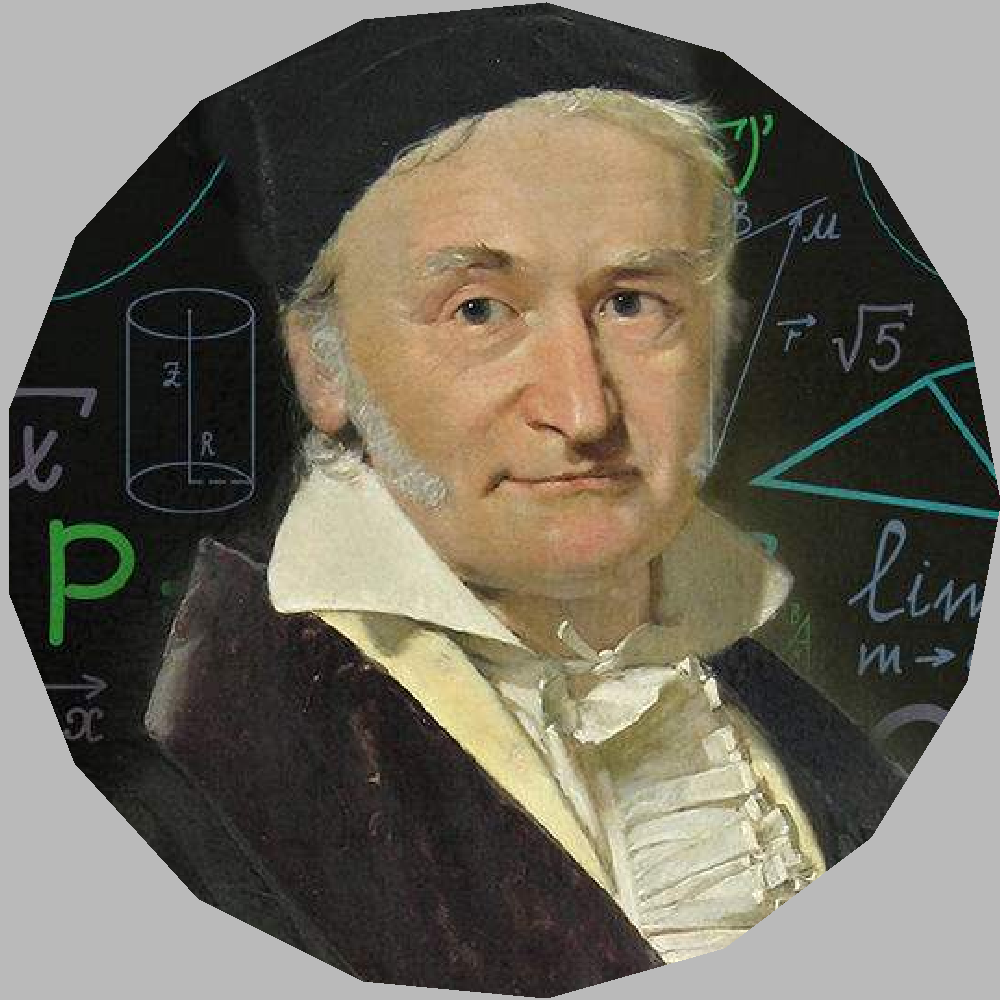

计算机图形学基础2019春课程作业。

## project0: rasterization

光栅图形学作业(总评10’)

实现一个感兴趣的光栅图形学算法

基本选题：画线(6’)；画弧(8’)；区域填充(10’)

加分项：实现某一种抗锯齿的方法(2’)；相交线反走样的case(4’)；边界反走样(2’)

**区域填充需要包含多边形绘制功能**

### result

一个正十七边形里的高斯：



## project1: ray tracer

参数曲线/曲面的三维造形与渲染(总评60')

算法选型(30'): 需要实现对应效果才为有效

- 参考基准: RT: 15', PT: 20', PM: 25', PPM: 30'. 实现有明显bug的扣分

实现网格化求交(5') or 实现参数曲面求交(15')
- 解方程请写出求解过程，其他请写出迭代过程

算法型加速(10')

GPU并行加速(5')（**OpenMP不算**）

景深/软阴影/抗锯齿/贴图/凹凸贴图等(10')

主观分:设计和构图(-10'~10')

其他额外效果: PBR、体积光、色散、体渲染等($\infty$)

### result

放几个jpg的图像，小不少，为大家节约流量


## project2: mesh simplification

今年修改了题目，不再是往年的三个图像处理作业，改为了基于边塌缩的增量网格简化(总评30')，不过可以提前向助教申请做往年题目，我做的是seam\_carving，我想明年应该不会再允许了

### 基本要求

阅读SIG’97论文，实现基于边收缩的二次误差网格简化方法。

程序能指定输入输出的obj格式文件，以及面数的简化比（输出面数占输入面数的百分比），例如命令行程序可以支持如下参数

```
./mesh_simp  in.obj  out.obj  简化比(例如0.3)
```

### 扩展功能
- 其他网格简化方法的实现和对比
  - 不同代价函数
  - 不同简化策略
    - 点删除
    - 面收缩
- 网格半边结构的实现

据助教说完成基本要求即可拿到满分

### result

只有seam\_carving的结果了，没什么参考价值。一只可爱的青蛙：


